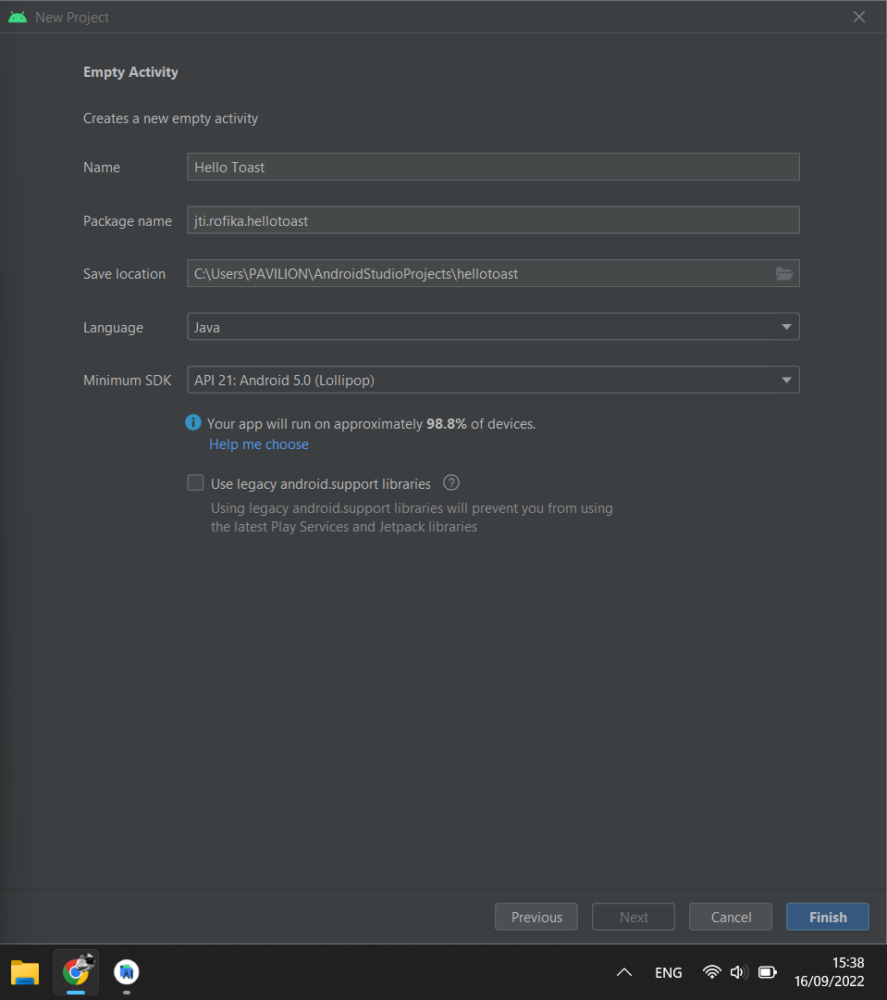
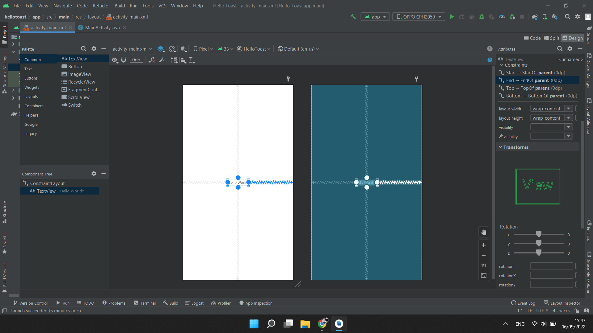
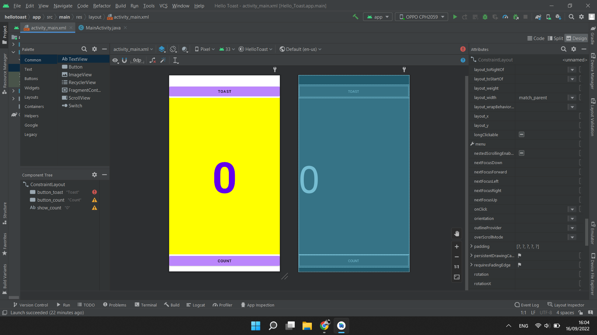
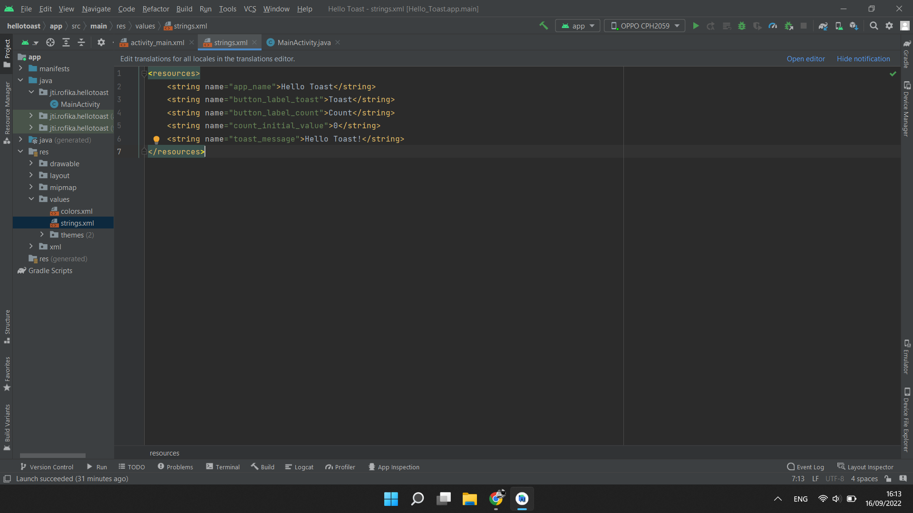
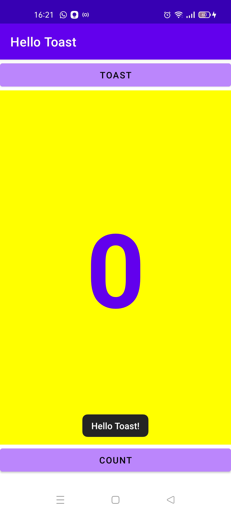
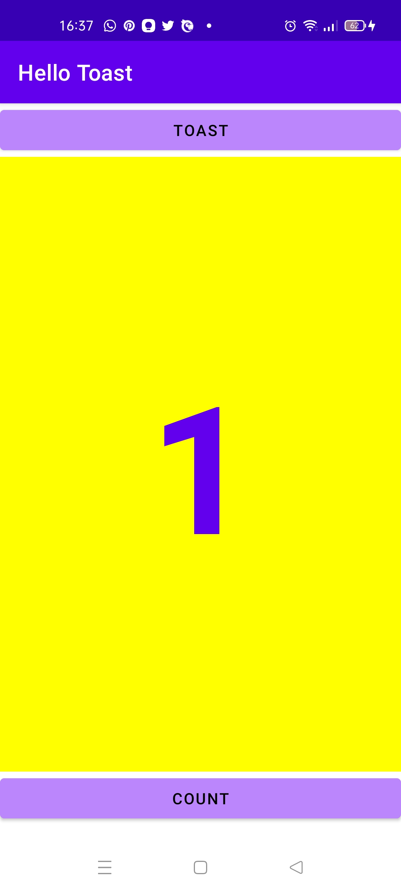

NIM  : 2041720099
Nama : Rofika Nur 'Aini
Kelas: TI-2B

1.2 Layouts and resources for the UI
1.2A : Your first interactive UI

Hasil Praktikum
Task 1: Create and explore a new project

Task 2: Add View elements in the layout editor

Task 3: Change UI element attributes

Task 4: Add a TextEdit and set its attributes

Task 5: Edit the layout in XML

Task 6: Add onClick handlers for the buttons

