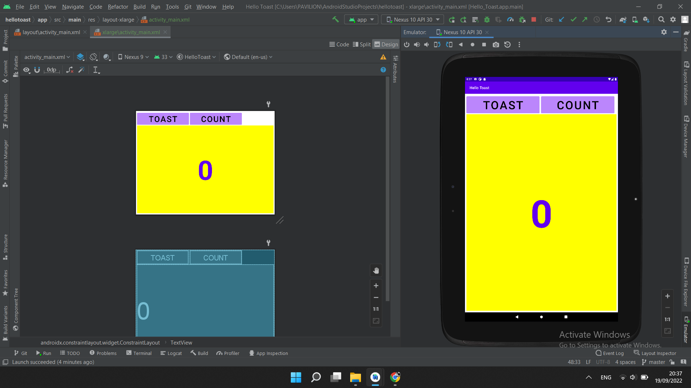
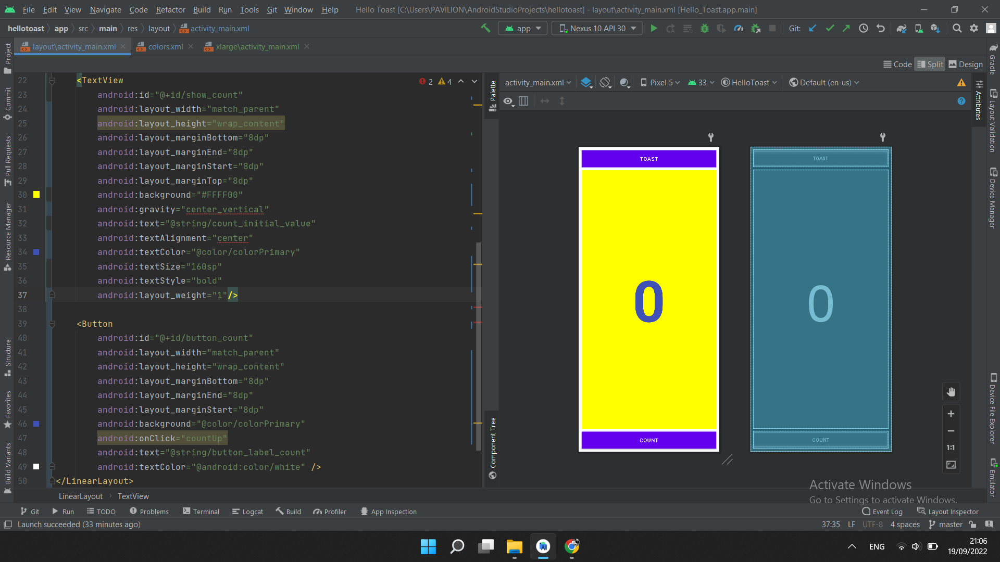
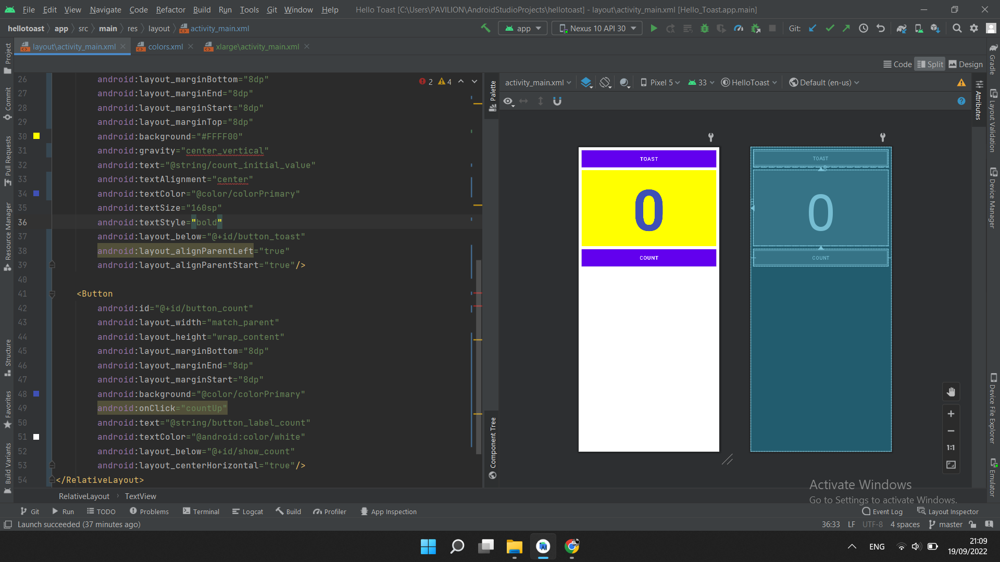

NIM  : 2041720099
Nama : Rofika Nur 'Aini
Kelas: TI-2B

1.2 Layouts and resources for the UI
1.2 Part B:The layout editor

Hasil Praktikum
Task 1: Create layout variants

Task 2: Change the layout to LinearLayout

Task 3: Change the layout to RelativeLayout

